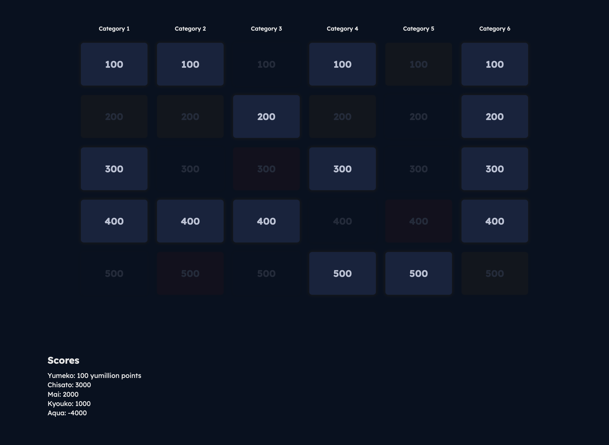
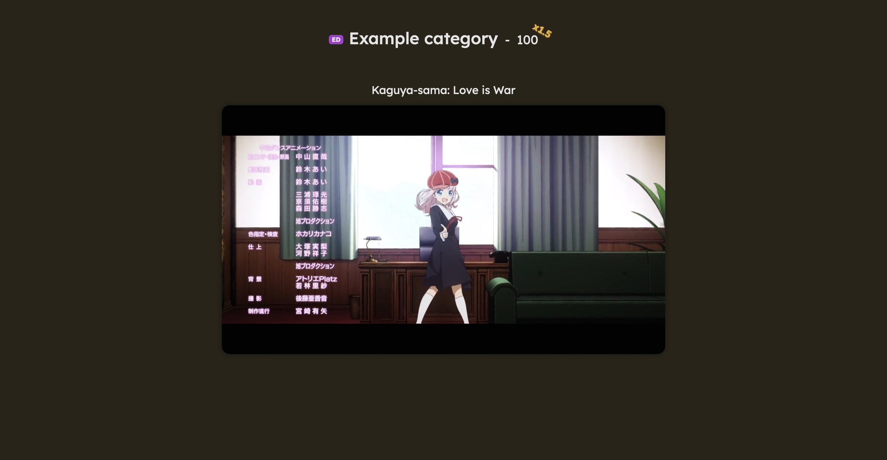
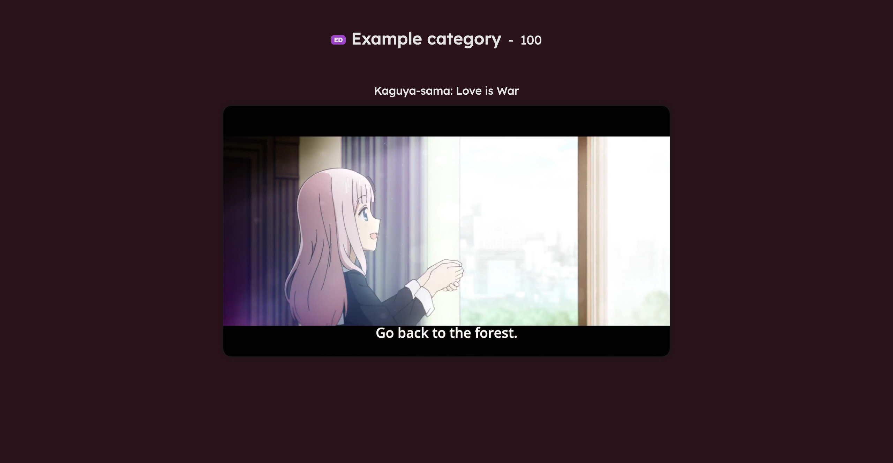

# (Anime) (Music) Jeopardy

Jeopardy with a bonus round. Made with anime music in mind but could be used for anything with videos.

## IMPORTANT

This web app was made for personal use but I've provided these instructions in case other people want to use it. No further support will be provided.

Feel free to use and/or fork but please credit me and do not make money off of it.

## Installation

1. [Install npm](https://docs.npmjs.com/downloading-and-installing-node-js-and-npm) if necessary
2. `npm install`

## Configuring a game

1. Edit `src/lib/data.ts`:
   1. Define category names in `getCategoryTitle()`
   2. Define music details in `answers`. In addition to the required `series` and `filename` properties optional `volume` and `source` values may be specified:
      - `volume` can be used to help normalize audio levels (default: 1)
      - `source` can be one of `MusicSource.OPENING` (default), `MusicSource.ENDING`, `MusicSource.MOVIE`, and `MusicSource.OVA`
   3. Define the example music's details in `example`. It's recommended to use non-opening music to demonstrate the source type tag
2. Place the full videos in `static/full` and the bonus round shortened versions in `static/short`. Both file names should correspond with what was entered in `data.ts`
3. The global volume can be changed in `src/routes/[index]/+page.svelte` by `GLOBAL_VOLUME`
4. A game format (rules) explanation and final jeopardy can be defined in `src/routes/format/+page.svelte` and `src/routes/final/+page.svelte`, respectively. You'll need to write your own html for those, sorry

Notes:

- Controlling volume through configuration is rather limited and it's recommended to modify the files themselves
- If a video takes longer than a second to start playing in browser it's recommended to try reencoding it
- The above can be done at the same time with ffmpeg: `ffmpeg -i <input.mp4> -filter:a "volume=<volume>" <output.mp4>`

## Starting the web app

1. `npm run dev`
2. Navigate to [http://localhost:5173](http://localhost:5173) in your web browser. Any browser should probably work but this web app was most thoroughly tested with Firefox

## Game controls

### All pages

- `Esc` - Return to main page (categories)
- Scroll to the bottom of the page and click in the empty space to access a text box that can be used to keep track of scores

### Main page

- `f` - Go to game format page (rules)
- `e` - Go to example music page
- `c` - Reveal categories
- `\` - Go to final jeopardy page
- `Shift-R` - Reset game state

### Music page

- `Space` - Play/pause current stage's music (initially bonus round/shortened music)
- `Enter` - Advance to normal (non-bonus) stage and play full music
- `Shift-S` - If in normal stage, show video
- `Shift-G` - Mark as guessed and play + reveal full video
- `Shift-F` - Mark as failed and play + reveal full video
